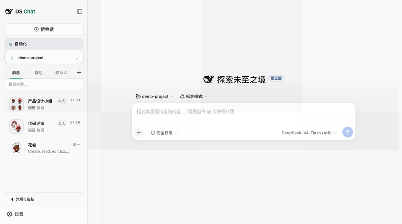
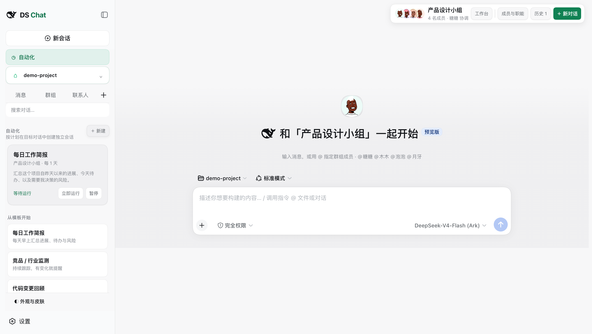
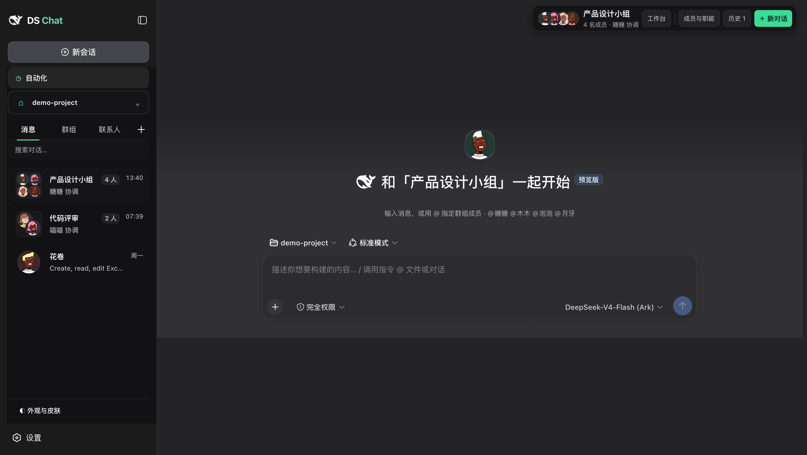

# DeepSeek Harness Chat UI

> A personified, social AI collaboration interface for DeepSeek Harness — Skills become recognizable digital members that users can discover, personalize, message directly, and bring into persistent group chats.

This is **not another ChatGPT-style single-assistant shell**. DS Chat treats every Skill as a social identity with a friendly name, a generated portrait, a profile, a direct-message relationship, and a role inside long-lived group rooms. Skills from every agent tool on the machine — Claude Code, WorkBuddy, Codex, Hermes, Doubao, Trae — become contacts you can message and group, and adding one to a room makes it genuinely loadable by the model, not just a name on a card.

[中文说明](README.zh.md) · [Features](#features) · [Install](#install-from-github) · [Development](#development)

## Demo



The demo walks the room list, opens a Skill group, inspects its members and system role, switches rooms and returns with the conversation intact, then scrolls the contact directory — several hundred Skills, each with its own generated identity.

[Watch the 26-second MP4 demo](docs/media/deepseek-harness-chat-ui-demo.mp4)


## Why this project

DeepSeek Harness provides a powerful agent runtime, but its default interface is organized around sessions and workspaces. This plugin turns Skills into a personified social collaboration network with contacts, direct conversations, persistent groups, and visible member identities:

- **Persistent rooms** restore the previous conversation instead of silently creating a new session.
- **Normal chat** works without selecting a Skill.
- **Personified Skills** appear as recognizable contacts with deterministic names, illustrated portraits generated per Skill (DiceBear Micah, see Credits), profiles, and original capability metadata.
- **Group chats** let users search Skills, pull them into a group, choose a coordinator, and define a reusable group system prompt; a Skill that joins is linked into the Harness's Skill root, so the model can actually load it.
- **Automation** is a top-level destination beside the shell's own new-chat entry, connecting scheduled tasks to rooms and conversation history.
- **Project and terminal sidecars** keep files and command-line work beside the active conversation.
- **Skin support** allows declarative visual themes without touching Room or automation data.

## Screenshots

### Create a group with personified Skills

Search installed Skills, add or remove them like group members, choose a circular group avatar, and define the group's role as its system prompt.


### Scheduled automations

Every automation runs in the room it belongs to. Pick a scenario to prefill the
name, prompt and cadence, or start from a blank one.



### Theme center


## Features

| Area | Capability |
| --- | --- |
| Social chat | Normal chat, Skill contacts, direct conversations and group chats in one recency-sorted room list, with persistent search |
| Room management | Pin, drag to reorder, archive, delete, and save a room as a team that follows you across projects |
| Groups | Searchable members, coordinator selection, group system prompt, project binding; a 2x2 tile of up to four member portraits identifies the room |
| Personification | Generated portraits, deterministic friendly names, profiles and original Skill metadata |
| Skills | Every agent tool's Skill directory in one catalog, `skills.sh` search, install and install-then-add flows |
| Real invocation | Joining a room links the Skill into the Harness's own Skill root, so the model can actually load it |
| Parallel members | When a task needs several members the coordinator delegates one background subagent per member, each loading that member's Skill — real concurrency, not a narrated one |
| Per-speaker faces | Each relayed answer carries the portrait of the member who wrote it, so a group reads as a group |
| Workspace | Project browser, file preview, terminal and sidecar task entry points |
| Automation | A top-level destination beside the shell's own new-chat entry, scenario templates, room-bound definitions, run-now and persisted history |
| Appearance | Mint and Teamily-inspired skins using the DSH Web Skin Manifest v2 contract. A skin states identity and shape; light and dark stay the shell's, so every skin is complete in both |



## Requirements

- DeepSeek Harness `0.1.2-alpha.5`
- Node.js `22.19+` or `24+`
- `pnpm` available on `PATH` because `dsh plugin` delegates package installation to pnpm

## Install from GitHub

The repository contains both the original TypeScript/React/CSS source and committed browser/host build artifacts. Harness users can install it directly from GitHub without downloading a release archive:

```sh
dsh plugin --profile web add github:lileilei2023/deepseek-harness-chat-ui
dsh --profile web
```

Remove it with:

```sh
dsh plugin --profile web remove deepseek-harness-chat-ui
```

## Install from a cloned repository

```sh
git clone https://github.com/lileilei2023/deepseek-harness-chat-ui.git
cd deepseek-harness-chat-ui
npm install
./install-ds-chat.sh
```

Windows users can run `install-ds-chat.cmd`; macOS users can double-click `install-ds-chat.command`.

## Source code

The complete editable implementation is committed under `source/`:

```text
source/
├── client-ui-skill-chat/       # React UI, Room state, personas, skins and sidecars
├── workbuddy-skill-catalog/    # Host service, persistence, Skill install and automation APIs
└── skill-chat-web-profile/     # Original Harness profile bundle
```

`dist/` contains the reviewed build consumed by users installing directly from GitHub. It is committed intentionally so installation does not execute a remote `prepare` script.

## Development

DeepSeek Harness is still pre-release and its Web client bundler lives inside the Harness repository. Use a dedicated matching Harness checkout or worktree when rebuilding:

```sh
git clone --depth 1 --branch dsh-v0.1.2-alpha.5 https://github.com/deepseek-ai/deepseek-harness.git
cd deepseek-harness
pnpm install

cd ../deepseek-harness-chat-ui
npm install
npm run rebuild -- ../deepseek-harness
npm run check
```

`npm run rebuild` materialises the three plugin packages under the Harness checkout's `packages/experimental`, registers them in the `tsconfig.host.json` and `tsconfig.client.json` project-reference aggregates, builds the Host and Client faces, and refreshes `dist/`. Pass `--client-only` to skip the Host face while iterating on the UI. Do not point it at a checkout containing uncommitted work.

`npm run build` is the original entry point. It drives the Harness's full workspace build and expects the three packages to already exist under `packages/experimental`, which a clean public checkout does not have — use `npm run rebuild` there.

## Skill sources

The catalog scans directories for `SKILL.md` files and lists what it finds as contacts. Listing is a read-only metadata scan: nothing is downloaded or executed. Every agent tool's usual location is scanned by default, because a root that does not exist costs one failed `readdir` and asking a person to configure paths costs more:

| Root | Path | Layout |
| --- | --- | --- |
| WorkBuddy | `~/.workbuddy/plugins/cache/workbuddy-builtin` | `<plugin>/<version>/**` |
| WorkBuddy (user) | `~/.workbuddy/skills` | `<skill>/SKILL.md` |
| Claude Code | `~/.claude/skills` | `<skill>/SKILL.md`, plus one level of bundles |
| Claude plugins | `~/.claude/plugins/marketplaces` | nested |
| Codex | `~/.codex/skills` | `<skill>/SKILL.md` |
| Hermes | `~/.hermes/skills` | `<skill>/SKILL.md` |
| Doubao | `~/DoubaoWork/skills` | `<skill>/SKILL.md` |
| Trae | `~/.trae/builtin/global/skills` | `<skill>/SKILL.md` |
| OpenClaw | `~/.openclaw/skills` | `<skill>/SKILL.md` |
| Shared | `~/.agents/skills` | `<skill>/SKILL.md` |

A Skill name found under more than one root keeps the first root's entry, so roster order is precedence order. Override the roster from the profile's patch layer:

```yaml
- id: workbuddy-skill-catalog
  config:
    roots:
      - { id: workbuddy, label: WorkBuddy, path: '~/.workbuddy/plugins/cache/workbuddy-builtin', layout: plugin-version }
      - { id: team, label: Team, path: /srv/shared/skills, layout: flat }
```

### From contact to callable

A scanned Skill starts as a contact card. The Harness's Skill service has never seen it, so a model asked to load one answers `skill "X" is unknown or no longer available`. Adding the Skill to a room fixes that: DS Chat symlinks the bundle into `$DSH_HOME/skills`, the Harness's own user-level Skill root, which it already watches for changes.

Linking rather than copying is deliberate. The tool's own directory stays the single source of truth, edits there take effect immediately, and there is no sync job to run or forget. Only the Skills you actually put in a room are linked, so a machine with several hundred installed Skills does not push all of them into every session's catalog. Removing a link is one `unlinkSkill` call, and links this plugin did not create are never touched.

## Known gaps

The surface is broad; several details are not yet polished — the terminal in particular is a snapshot-per-command view rather than a live stream. `TODO.md` lists them in severity order, with what is wrong and what "done" looks like. `CLAUDE.md` carries the build, verification and footgun notes for anyone working in this repository.

## Credits

Skill portraits are generated locally with [DiceBear](https://www.dicebear.com) (MIT) using the **Micah** style — *Avatar Illustration System* by [Micah Lanier](https://dribbble.com/micahlanier), licensed [CC BY 4.0](https://creativecommons.org/licenses/by/4.0/). Nothing is fetched at runtime: the generator is bundled and every portrait is derived from the Skill's own id.

## Compatibility

The first release intentionally targets DeepSeek Harness `0.1.2-alpha.5`. Harness APIs are evolving quickly, so future Harness versions may require a matching plugin release. Model providers, API keys, permissions, and session logs remain managed by Harness; this repository does not include credentials.

## License

MIT. The extracted code retains attribution to the original DeepSeek Harness project.
