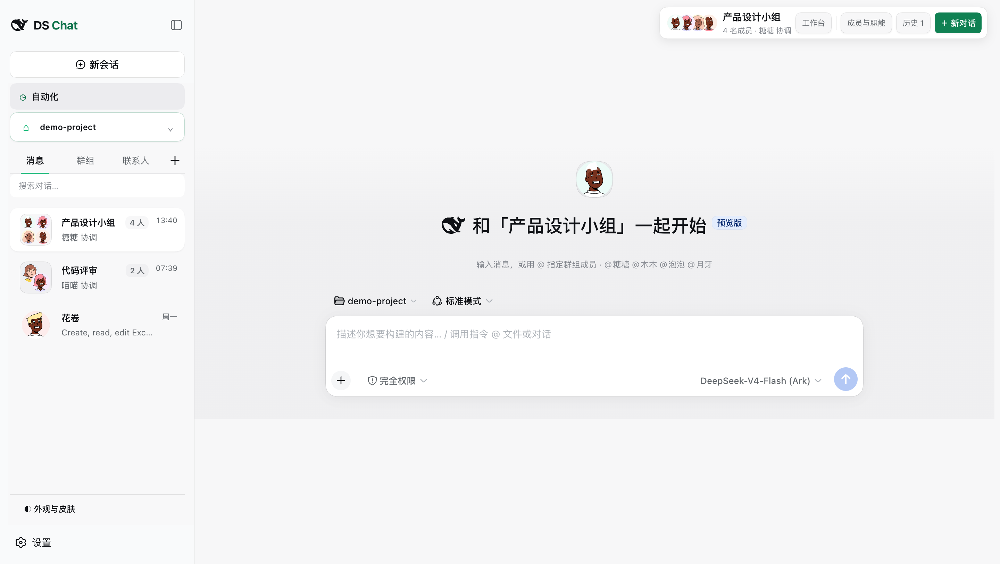
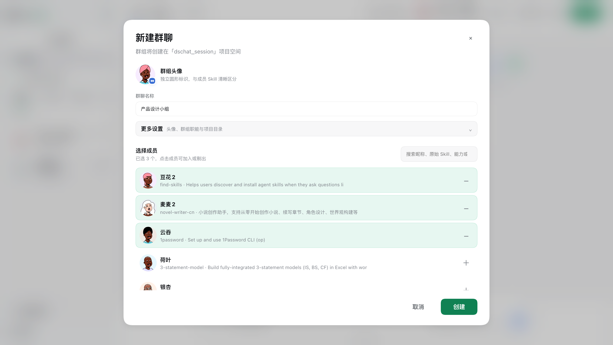
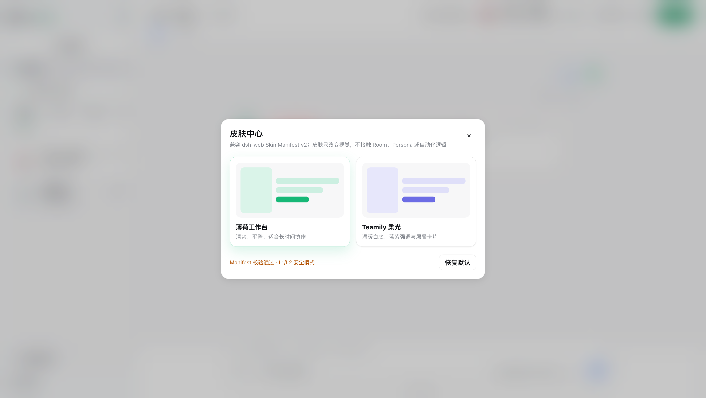

# DeepSeek Harness Chat UI

> 面向 DeepSeek Harness 的社交媒体式 AI 协作界面：把 Skill 拟人化为可发现、可加为联系人、可私聊、可拉群的数字成员。

[English](README.md) · [功能](#功能) · [安装](#从-github-直接安装) · [开发](#源码开发)



## 为什么做这个项目

DeepSeek Harness 提供了强大的 Agent Runtime，但默认界面更偏向 Session 和 Workspace。本插件把 Skill 组织成一个社交化协作网络，强调联系人、私聊、群聊和清晰的成员身份：

- **持久化 Room**：切换群组再回来时恢复原对话，不再隐式创建 Session。
- **普通对话入口**：不选择 Skill 也能直接和模型交流。
- **Skill 拟人化**：每个 Skill 都有稳定昵称、纯圆动物头像、资料页和原始能力信息。
- **可以拉群**：像社交软件一样搜索 Skill、加入或剔除群成员、设置协调者和群组 System Prompt。
- **自动化入口**：将计划任务、运行记录和目标 Room 联系起来。
- **文件与终端侧栏**：在当前对话旁打开项目文件、终端和临时任务。
- **皮肤系统**：通过声明式 Skin Manifest 修改视觉，不接触 Room、Persona 或自动化数据。

## 截图

### 把拟人化 Skill 拉进群聊

可以像社交软件拉群一样搜索已安装 Skill、加入或剔除成员、选择圆形群组头像，并设置用于 System Prompt 的群组职能。



### 皮肤中心



## 功能

| 模块 | 能力 |
| --- | --- |
| 社交对话 | 普通对话、Skill 联系人、私聊、群聊、可折叠会话历史 |
| 群组 | 成员搜索、协调者、群组职能、项目目录绑定 |
| Skill 拟人化 | 纯圆动物头像、稳定友好昵称、资料页和原始 Skill 元数据 |
| Skills | 已安装目录、`skills.sh` 搜索、安装、安装并加入 |
| Workspace | 项目文件浏览、文件预览、终端与旁路任务入口 |
| 自动化 | Room 绑定、立即运行与运行历史 |
| 外观 | 薄荷工作台、Teamily 柔光以及 DSH Skin Manifest v2 |

## 环境要求

- DeepSeek Harness `0.1.2-alpha.5`
- Node.js `22.19+` 或 `24+`
- 命令行中可使用 `pnpm`，因为 `dsh plugin` 会通过 pnpm 安装插件

## 从 GitHub 直接安装

仓库同时提供完整 TypeScript/React/CSS 源码和经过验证的 Host/Web 构建产物，不需要下载 Release 压缩包：

```sh
dsh plugin --profile web add github:lileilei2023/deepseek-harness-chat-ui
dsh --profile web
```

卸载：

```sh
dsh plugin --profile web remove deepseek-harness-chat-ui
```

## 克隆源码安装

```sh
git clone https://github.com/lileilei2023/deepseek-harness-chat-ui.git
cd deepseek-harness-chat-ui
npm install
./install-ds-chat.sh
```

Windows 可以运行 `install-ds-chat.cmd`；macOS 可以双击 `install-ds-chat.command`。

## 原始源码

完整可编辑实现位于 `source/`：

```text
source/
├── client-ui-skill-chat/       # React UI、Room、Persona、皮肤和侧栏
├── workbuddy-skill-catalog/    # Host 服务、持久化、Skill 安装和自动化 API
└── skill-chat-web-profile/     # 原始 Harness Profile Bundle
```

`dist/` 是 GitHub 直接安装时使用的已验证构建产物。提交它是为了避免安装远程仓库时执行不受信任的 `prepare` 构建脚本，而不是用构建产物替代源码。

## 源码开发

DeepSeek Harness 仍处于预发布阶段，其 Web Client Bundler 位于 Harness 仓库内部。重新构建时请使用独立的匹配版本 checkout 或 worktree：

```sh
git clone https://github.com/deepseek-ai/deepseek-harness.git
cd deepseek-harness
git checkout v0.1.2-alpha.5
pnpm install

cd ../deepseek-harness-chat-ui
npm install
DSH_SOURCE=../deepseek-harness npm run build
npm run check
```

`npm run build` 会把本仓库的可编辑源码复制到匹配的 Harness checkout，调用官方 Host 和 Web Client 构建流程，再刷新 `dist/`。不要将它指向包含未提交改动的 Harness 工作目录。

## 兼容性

首个版本锁定 DeepSeek Harness `0.1.2-alpha.5`。Harness API 仍在快速演进，后续 Harness 版本可能需要对应的插件版本。模型提供方、API Key、权限和 Session 日志继续由 Harness 管理，本仓库不包含任何凭证。

## 许可证

MIT。抽取的代码继续保留对 DeepSeek Harness 原项目的归属说明。
